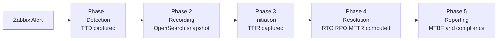
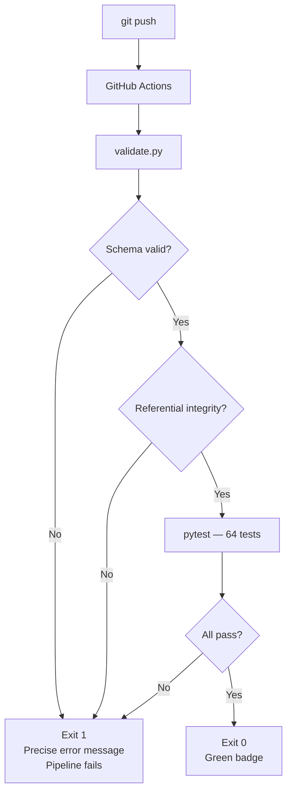

# Architecture

## Repository Boundary

This repository is the **Declarative Governance Layer** for the Servernah IaaS
compute platform. It is the static source of truth for SLA parameters, service
topology, and recovery sequencing.

It does not run infrastructure. It does not collect metrics. It defines the
contracts that the runtime infrastructure must honour.

The boundary is explicit:

| This Repository | Runtime Infrastructure |
|----------------|----------------------|
| JSON Schema contracts | Airflow DAGs polling Zabbix and MySupport |
| YAML service catalog | Spark jobs computing live RTO/RPO/MTTR |
| Recovery playbook | InfluxDB storing per-incident time-series metrics |
| Formula engine (Python) | PostgreSQL storing compliance records |
| Validation and test suite | Grafana dashboards serving live SLA status |

The `service_id` declared in `catalog/servernah-iaas-compute/service.yaml` is
the relational key that ties this static layer to every component in the live
monitoring stack. When Airflow detects a Zabbix alert, it scopes the incident
to a service by matching against this identifier.

## Repository Structure

```
servernah-sla-pipeline/
├── schemas/          JSON Schema contracts - the data contracts
├── catalog/          YAML service specifications - the declared state
├── scripts/          Python engine - validate, compute, simulate
├── tests/            Test suite - 64 tests proving engine correctness
└── docs/             Architecture and formula reference
```

## Five-Phase Incident Pipeline

The runtime infrastructure processes incidents in five phases. This repository
governs the parameters that drive phases 1 through 4.



The parameters that feed each phase: TTD, TTIR, TTCR, TTVR, backup frequency,
incident rate, and qualitative modifiers - are all declared in
`catalog/servernah-iaas-compute/sla-parameters.yaml` and validated against
`schemas/sla-parameters.json` on every commit.

## Validation Flow



## How the Catalog Feeds the Runtime

When the Airflow pipeline processes an incident against `servernah-iaas-compute`,
it reads the SLA thresholds declared in this repository to evaluate compliance:

1. `sla_targets.rto_minutes` defines the ceiling against which actual RTO is measured
2. `sla_targets.rpo_minutes` defines the ceiling against which actual RPO is measured
3. The qualitative parameters in `sla-parameters.yaml` are applied by the Spark
   adjusted metrics job to compute the infrastructure-aware targets
4. The recovery playbook defines the ordered failover sequence the on-call team
   executes, with each step's `estimated_duration_minutes` summing to the RTO ceiling
